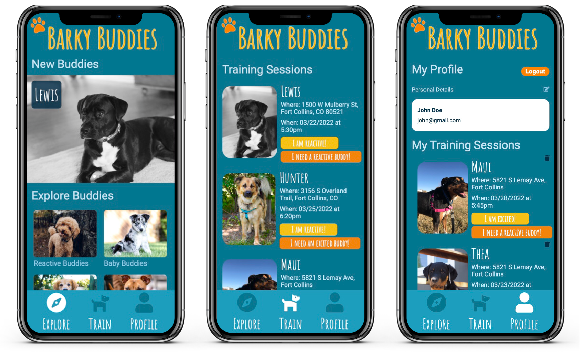

# Formula 1 Season Tracker

## Description

> Mobile-first web app for dog owners to create an account and buddy profile for their dogsmatch with other users
> Users can schedule training sessions using OAuth and Google Firestore cloud database

## Technologies

> This app was built using React and Google Firebase. It uses the Google Geocoding to convert addresses into geographic coordinates to generate a Leaflet map.

## Usage

### `npm install`

### `npm start`

Runs the app in the development mode. 
Open [http://localhost:3000](http://localhost:3000)

### `npm run build`

Builds the app for production to the `build` folder. 
